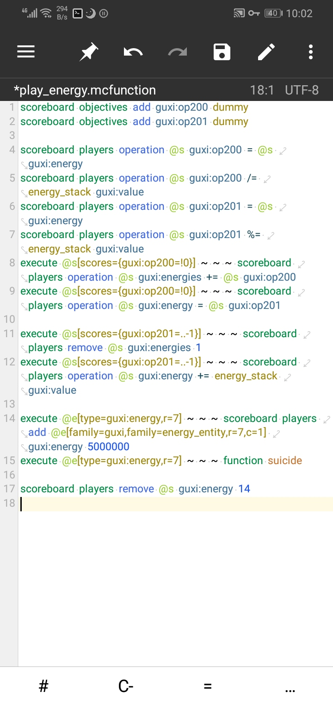
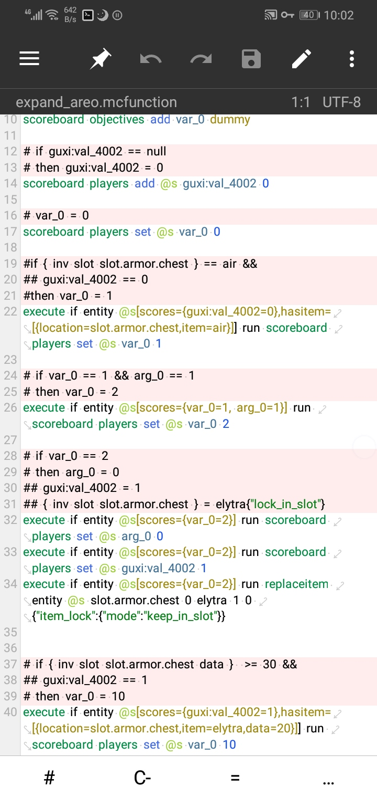

# mc-mt-syntax

没啥好说的，给用[mt管理器](https://www.coolapk.com/apk/bin.mt.plus)写addon的人的语法

目前只写了给mcfunction用的，之后可能试着添加其他的（比如json（如果可能分辨出来，否则也只能添加关键词高亮）

目前特色，五彩斑斓

支持阅读/scoreboard命令
支持阅读/function
支持大部分可在mcfunction中直接使用的命令的高亮（只能高亮命令本体）
（但是都不会纠错（别想了），也不会自动写（我也想））

## 展示

