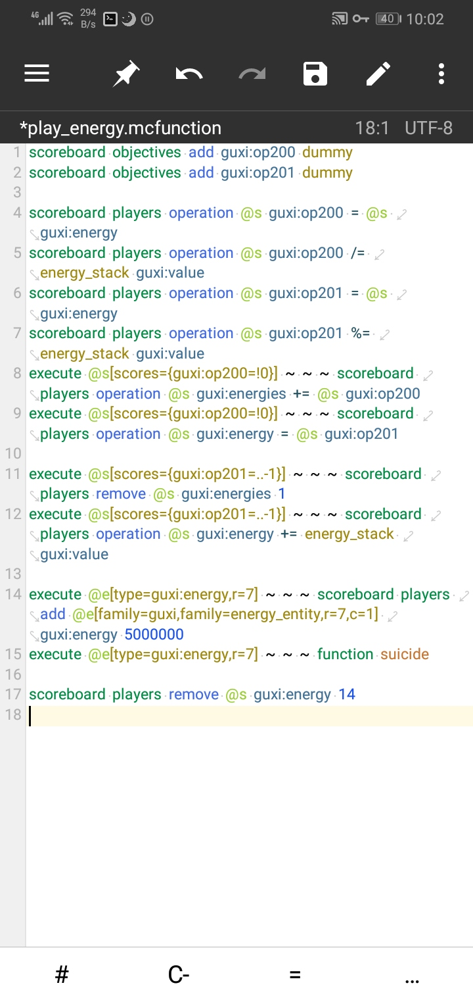
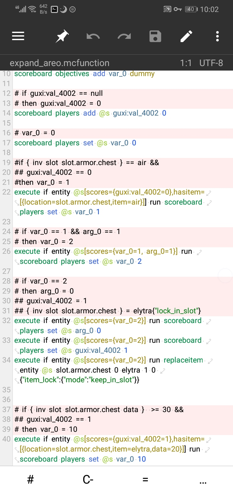
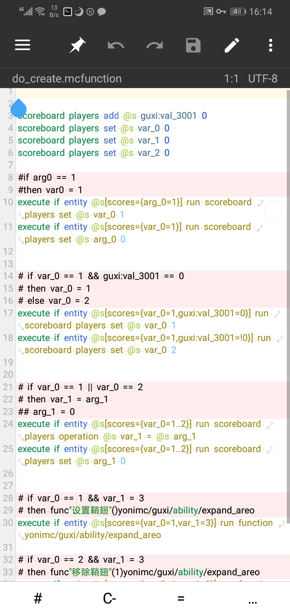
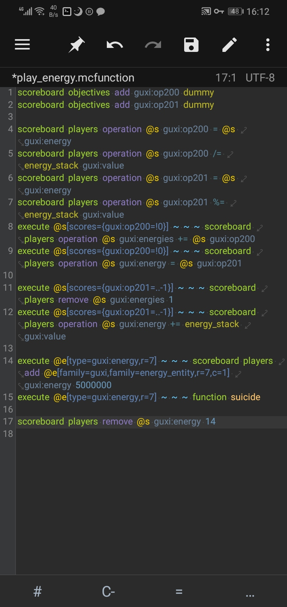
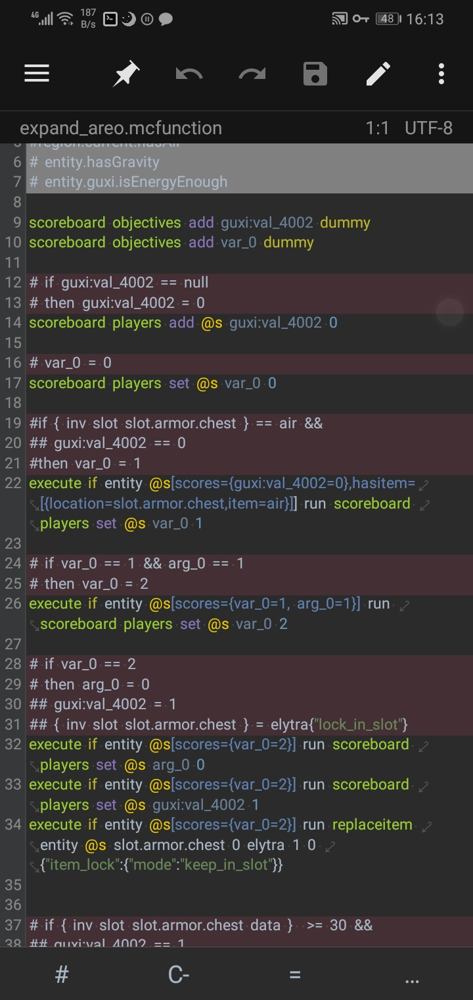
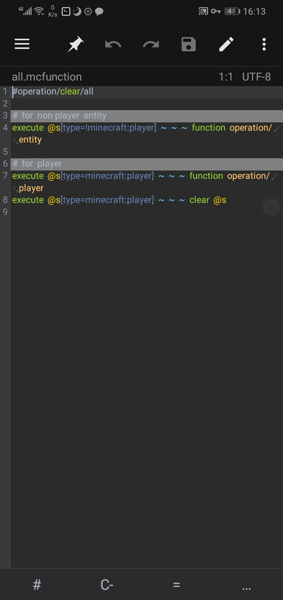
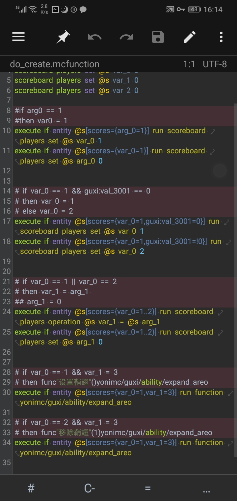

# mc-mt-syntax

为MT管理器编写的适用于Minecraft Addon编写的语法文件

目前只编写了适用于mcfunction文件的语法。之后可能会继续添加。比如json（如果可能分辨出来，否则也只能添加关键词高亮）

目前特色，五彩斑斓

注意，如果在使用的时候发现打开对应类型文件是空白的，或者写着写着写着就卡住或者崩溃了，请反馈给我，并附带原文件或你当时正在写的命令（我在编写的时候就发现了这个问题，后来修好了，但是难保以后不会出现，所以加上这句话，记得语法多了之后删掉这个括号里的内容）

## mcfunction支持

|命令       |高亮|纠错（简单）               |
|--------------------|-------|--------------------------------------------------|
|scoreboard|y   |只有operation中的操作符号  |
|function   |y   |x                             |
|execute    |y   |x                            |
|titleraw    |y   |原始JSON文本               |
|tellraw     |y   |原始JSON文本               |

支持大部分可在mcfunction中直接使用的命令的高亮（只能高亮命令本体）

对于/execute，如果你想使用旧版，请在文件中将旧版的高亮匹配放出来，并将新版的匹配删除，然后安装即可

由于这只是一个语法高亮，所以难以实现真正的纠错

目前已知同时在一行命令中使用两个目标选择器，且两个选择器都带有参数时，高亮显示会不正确。在可以对参数进行高亮前，无法完美修复，故暂不修复

## 链接

[MT管理器](https://www.coolapk.com/apk/bin.mt.plus)
[苦力怕论坛](https://klpbbs.com/thread-66574-1-1.html "适用于mt管理器的mcfunction语法高亮描述文件")

## 展示

